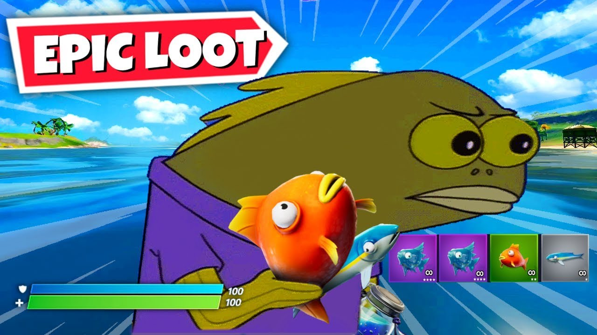

# Exercise 2

This picture is a complete meme from a horrendous game known as Fortnite. The image also contains a character from Spongebob Squarepants,
who is also used in a very popular meme. As you can see, there is an inventory with 4 hotbars containing 2 hotbars full of infinite Slurpfish (+40 Combined Health & Shield), a hot bar with infinite Floppers (+50hp), and a hotbar at the far right with infinite Small Fries (+25hp). Long Neck fish seems to be firmly grasping (no pun intended) a flopper and a small fry in one hand, and a big shield potion (+50 Shield) on the other. This deems to be some EPIC LOOT!

Learn the basics of git workflow, including adding new files.

1. **Fork** the repo onto your own github account  
(maybe you already did it).

2. clone it to your laptop  
`git clone ...`

3. Download an image from the web and place it into the repo folder
   into _exercise-2_ subfolder.
   
4. Add this file to _git_.  See [Adding
   Files](file:///home/otoomet/tyyq/teaching/info201/book/localbook/build/git-basics.html#adding-files). 

5. Add the image to this file using markdown syntax.
   
5. Write a paragraph of text where you explaine what the picture is
   about.  Feel free to add more.

4. commit your changes:  
`git commit -am "<explain what did you do>"`

5. send your edits back to GitHub
`git push`

6. check the repo on your github account.  Did it work?
